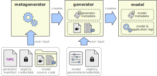

# REFORMERS Metagenerator for Digital Twin Model Generators

## About

The metagenerator automates the build process of model generator container images for the [REFORMERS] Digital Twin.
It relies on [kaniko](https://github.com/chainguard-dev/kaniko), a tool to build container images inside another container.



## Usage

The metagenerator follows a workflow with several steps to build a generator container image.
This workflow is made accessible to users via a dedicated [metagenerator container image available on GitHub](https://github.com/REFORMERS-EnergyValleys/reformers-dt-metagenerator/pkgs/container/metagenerator).

``` BASH
docker login ghcr.io
docker pull ghcr.io/reformers-energyvalleys/metagenerator:release
docker tag ghcr.io/reformers-energyvalleys/metagenerator:release metagenerator
```

*NOTE*: A [personal access token](https://docs.github.com/en/packages/working-with-a-github-packages-registry/working-with-the-container-registry#authenticating-with-a-personal-access-token-classic) is required for authentication to the container image registry.

### Input to the metagenerator

Users must provide the following input to the metagenerator:

+ **Generator manifest**:
  The generator manifest file contains the metainformation required for the build process of the generator image itself as well as the model the generator will produce.
  The content of the manifest file must be in [YAML](https://en.wikipedia.org/wiki/YAML) format, by default it should be named `GENERATOR-MANIFEST.yml`.
  See the [generator manifest reference](#generator-manifest-reference) below for more details.
+ **Model source**:
  The generator will produce container images for a specific model.
  All source code required for this (including a Dockerfile with build instructions) should be included in a single folder (with arbitrary sub-structure).
  By default, this folder should be named `model-src`.
+ **Generator registry credentials**:
  The generator container image created by the metagenerator will be uploaded to a container registry.
  The credentials required for accessing this container registry are provided via a config file (see [below](#registry-credentials-configuration-file) for details) and should be named `config.json` by default.

### Running the metagenerator

In case the generator manifest, the model source directory, and the registry credential file are all in the same directory `GENERATOR-SOURCE-DIR` and named according to their defaults (see above), the following command can be used to run the metagenerator:

``` BASH
docker run --rm -v <GENERATOR-SOURCE-DIR>:/workspace metagenerator
```

In case custom names for the generator manifest and/or the model source directory are used, they can be specified like this:

``` BASH
docker run --rm -v <GENERATOR-SOURCE-DIR>:/workspace metagenerator <GENERATOR-MANIFEST> <MODEL-SOURCE-DIR>
```

In case a custom name for the registry credential file is used, it must be mounted with its default name:

``` BASH
docker run --rm -v <GENERATOR-SOURCE-DIR>:/workspace -v <GENERATOR-REGISTRY-CONFIG>:/workspace/config.json metagenerator
```

Extra flags can be supplied to the metagenerator via environment variable `EXTRA_FLAGS`:

``` BASH
export EXTRA_FLAGS="--skip-tls-verify --cache=true"
docker run --rm -v <GENERATOR-SOURCE-DIR>:/workspace --env EXTRA_FLAGS metagenerator
```

The generator manifest, model source directory, and registry credential file can be mounted from arbitrary locations:

``` BASH
docker run --rm -v <PATH-TO-MANIFEST>:/workspace/GENERATOR-MANIFEST.yml <PATH-TO-REGISTRY-CONFIG>:/workspace/config.json -v <PATH-TO-MODEL-SOURCE-DIR>:/workspace/model-src metagenerator
```

## Build metagenerator image from source

A release version of the metagenerator is avilable on the [GitHub container registry](https://github.com/REFORMERS-EnergyValleys/reformers-dt-metagenerator/pkgs/container/metagenerator).
However, the following command can be used to build the metagenerator container image locally:

``` BASH
docker build -t metagenerator .
```

## Use the metagenerator to build images locally

By default, the metagenerator will store the newly created generator container image in a container registry.
However, it can also be configured to store it on a local machine.

Linux:
``` BASH
export BUILD_DIR=${PWD}/build
export IMAGE_TAR_FILE=image.tar
export EXTRA_FLAGS="$(echo --tar-path /build/${IMAGE_TAR_FILE} --no-push)"
docker run --rm -v <GENERATOR-SOURCE-DIR>:/workspace -v ${BUILD_DIR}:/build --env EXTRA_FLAGS metagenerator
docker image load -i ${BUILD_DIR}/${IMAGE_TAR_FILE}
```

Windows:
``` CMD
SET BUILD_DIR=%CD%\build
SET IMAGE_TAR_FILE=image.tar
SET EXTRA_FLAGS=--tar-path /build/%IMAGE_TAR_FILE% --no-push
docker run --rm -v <GENERATOR-SOURCE-DIR>:/workspace -v %BUILD_DIR%:/build --env EXTRA_FLAGS metagenerator
docker image load -i %BUILD_DIR%\%IMAGE_TAR_FILE%
```


## Generator manifest reference

### Schema
+ `<GENERATOR-NAME>.version`:
  Version of the generator (will become the tag of the generator image)
+ `<GENERATOR-NAME>.config`:
  Specify parameters for the generator config.
  These parameters typically stay the same for different versions of the same model.
  When generating the model, you can define environment variables of the same name to change the default values defined here.
  Mandatory fields are `GENERATOR_REGISTRY` (URL to generator registry), `MODEL_REGISTRY` (URL to model registry, and `MODEL_DOCKERFILE` (Dockerfile for the model build process, relative to model source directory).
+ `<GENERATOR-NAME>.parameters`:
  Add information about build parameters.
  Each parameter should have a `info` and `default` field, providing information about their use and the default value, respectively.
  These parameters are  typically different for different versions of the same model.
  When generating the model, you can define environment variables of the same name to change the default values defined here.
+ `<GENERATOR-NAME>.build`:
  Optional info for the build process

### Example

``` YAML
---
example-generator:
  version: v3
  config:
    GENERATOR_REGISTRY: reformers-dev.ait.ac.at:8082
    MODEL_REGISTRY: reformers-dev.ait.ac.at:8083
    MODEL_DOCKERFILE: Dockerfile_model
  parameters:
    CONFIG_FILE:
      info: path to config file with default values
      default: /config/config.yml
    GRID_DATA:
      info: path to grid data
      default: /grid_data/grid.json
  build:
    cache:
      - python:3.10
      - python:3.10-slim
```

## Registry credentials configuration file

The metagenerator pushes the generator container image to a registry.
For this, the metagenerator requires credentials for accessing and updating the registry.
The credentials are read from a file named `config.json`, which should look like the following:

``` JSON
{
    "auths": {
        "<registry-url>": {
            "auth": "<registry-auth>"
        }
    }
}
```

The `<registry-url>` provides the URL to the registry.
The `<registry-auth>` provides the docker registry user and password encoded in base64:

``` BASH
echo -n <user>:<password> | base64
```

## Funding acknowledgement

 This development has been supported by the [REFORMERS] project of the European Union’s research and innovation programme Horizon Europe under the grant agreement No.101136211.

[REFORMERS]: https://reformers-energyvalleys.eu/
